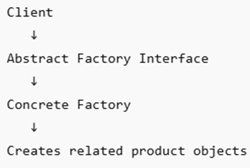

# Abstract Factory
The abstract factory is also a creational design pattern that provides an interface to create similar types of objects (for example, push button, check boxes, and radio buttons) without specifying to concrete class. Instead of creating multiple objects consecutively through new keyword. 

When an application runs, it uses the factory class or component that in turn creates multiple similar objects. The pattern promotes consistency among related components and reduces tight coupling between object creation and business logic. Conclusively, Instead of hardcoding each object, the application asks a factory to create these objects.

## Basic Flow

Application: **GUI Factory--->Create Button--->Check boxes**.