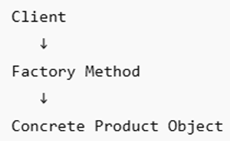

# Factory Method
In the factory method design pattern, the parent class defines a method or a subclass to create an object. The parent method does not create the object by using the new keyword. At the runtime, the application calls the factory method to create the object. The Factory Method design pattern follows the concept of polymorphism and inheritance. It separates the object creation logic from the business logic by using the object.
The main difference between the Abstract Factory and Factory Method is as follows: 
* The Abstract Factory design pattern creates multiple related objects.
* The Factory Method design pattern creates single object.

## Basic Flow

Example: **Application → createNotification() → EmailNotification**

The Factory Method is not a full architectural design pattern, but it strongly influences extensible software architecture. It reduces the tight coupling. 
